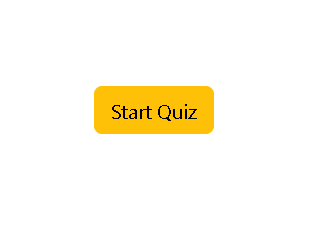
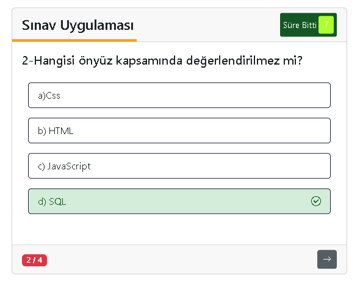
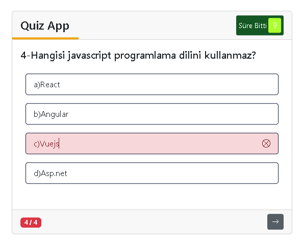
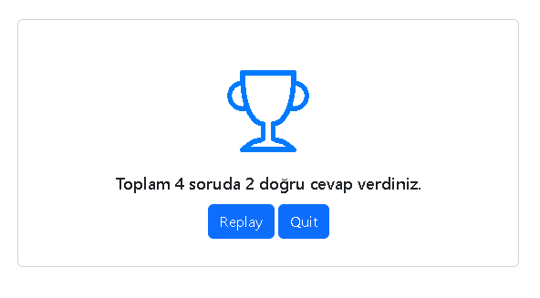

## JavaScript Quiz Application (OOP & Dynamic UI)

Bu proje, modern JavaScript (ES6+) ve Nesne Yönelimli Programlama (OOP) prensipleri kullanılarak geliştirilmiş, zaman kontrollü ve dinamik olarak render edilen interaktif bir quiz uygulamasıdır.

Uygulama; kullanıcı etkileşimi, DOM manipülasyonu ve zaman yönetimi gibi temel frontend konseptlerini pratik etmek amacıyla tasarlanmıştır.

## Ekran Görüntüleri

### 1. Başlangıç Ekranı

Uygulama açıldığında kullanıcıyı karşılayan ve testi başlatan giriş ekranı.

### 2. Soru Arayüzü ve Süre Yönetimi

Soruların dinamik olarak geldiği, üst kısımda "Time Line" (Süre Çubuğu) ve sağ üstte geri sayımın olduğu ana ekran.

### 3. Cevap Kontrolü ve Geri Bildirim

Kullanıcı bir seçim yaptığında doğru/yanlış durumuna göre şıkların renklenmesi ve ikonların belirmesi.

### 4. Test Sonuç Ekranı

Tüm sorular tamamlandığında kullanıcının toplam başarısını gösteren skor tablosu.

## Kullanılan Teknolojiler

- **HTML5 & CSS3** (Özel animasyonlar ve Bootstrap 5 desteği)
- **JavaScript (ES6+)** (OOP, Constructor, Prototypes)
- **Zaman Yönetimi:** `setInterval` ve `clearInterval` ile süre kontrolü.
- **Bootstrap Icons** (Görsel geri bildirimler için)

## Öne Çıkan Özellikler

- **OOP Tabanlı Mimari:** `Soru`, `Quiz` ve `UI` bileşenleri ile ayrıştırılmış yapı
- **State Management:** Soru indexi ve skor takibi
- **Dinamik DOM Rendering:** Soruların runtime’da oluşturulması
- **Zaman Yönetimi:** `setInterval` ile senkron geri sayım ve progress bar
- **Interactive Feedback:** Doğru/yanlış cevaplara anlık görsel tepki

## Kurulum ve Çalıştırma

1. Projeyi bilgisayarınıza indirin veya klonlayın.
2. Klasör içindeki `index.html` dosyasını tarayıcınızda açarak hemen kullanmaya başlayın.

## Planlanan Özellikler

- API üzerinden dinamik soru çekme
- LocalStorage ile skor kaydetme
- Kategori bazlı quiz sistemi
- Dark mode desteği
- Mobil uyumluluk iyileştirmeleri
